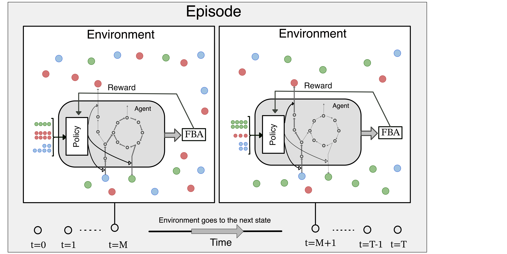

# SPAM-DFBA Documentation Website

SPM-DFBA is an algoritm for inferring microbial interactions by modeling microbial metabolism in a community as a decision making process, a markov decision process more specifically, where individual agents learn metabolic regulation strategies that lead to their long-term survival by trying different strategies and improve their strategies according to proximal policy optimization algorithm.

------------
**Why reinforcement learning?**

(This image is created with DALL.E 3)

The motivation for creating this framework was one of my favorite experiments in microbiology!

How can we predict such behaviors by relying only on genotype of the cells and minimal phenotypic data? The answer is not very strightforward and here is why:

Flux balance analysis(FBA) is a commonly-used approach in system biology to determine the rate of each biochemical reaction within the cell. In this approach the cells are modeled as constant-volume bioreactors and they can exchange metabolites to the outside. Writing mass balance equations across this "bioreactor" results in a system of ordinary differential equtions(ODEs) that describes the concentration profiles in the reactor over time. The issue with solving such system of ODEs is that we need the kinetic expression and the kinetic parameters for every reaction in this system. This is currently near impossible to do! Flux balance analysis deals with this problem by making a simplifying, yet somewhat realistic, assumption that the internal flux of the cells change much faster than the changes in the environment and the cells can achieve a state of homeostasis. This means that we can assume that the systems is at steady state and we can convert the system of ODE into a system of equations. However, mass balance itself is not enough to solve this system of linear equations. For a genome-scale metabolic model, we have more unknowns than equations. To solve this system of equations, we need to make another assumption. The most common assumption is that the cells are in a state of maximum growth rate. with this assumption we can turn the system of equations into a linear programming problem and solve it to find the fluxes.

FBA can also be used in a dynamic setting by assuming steady-state at each timepoint and solving the underlying LP problem and calculate the changes in the environment and going to the next timepoint. This method is called dynamic flux balance analysis or DFBA. 

Let's go back to the cool experiment linked above. The way that cells survive in each of these scenarios is by changing their metabolic fluxes. They have to produce compounds that can fight the antibiotics. These compounds need ATP to be produced.  This means that the cells are not in a state of maximum growth rate. As a result, DFBA fails to predict the growth of microbes in this environment. 

On the other hand it makes sense to assume that evolution has shaped the cells to maximize their survival. However, survival should be vied as a long-term goal. This means that the cells should be able to make decisions that might not be optimal in the short-term but can lead to their long-term survival. This is where reinforcement learning comes into play. In a reinforcement learning problem, an agent interacts with the environment and receives a reward for each action. The goal of the agent is to maximize the cumulative, discounted, reward and by trial and error they learn the best strategy to achieve this goal. 

This approach in any sense does not imply that the cells are intelligent. It is just a mathematical framework that can be used to model how evolution shapes the cells to maximize their survival and why we see certain behaviors in microbial communities. The following figure shows the general framework of this approach:

We have tested this algorithm on multiple toy cases and one real world example. 

In order to find out more about the code structure and the API please visit the API page in the navigation bar. 

The examples are grouped by the similarities in their environment and they are included in the Case Study pages which could be found in the navigation bar.

